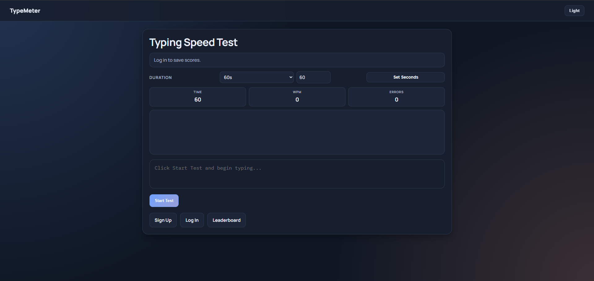
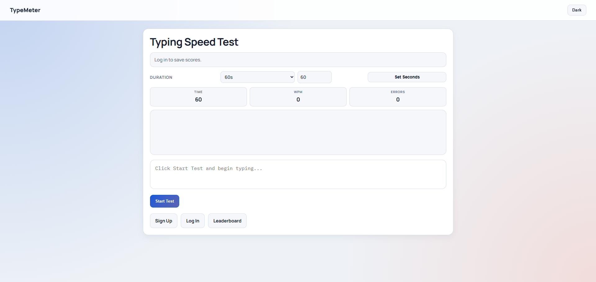
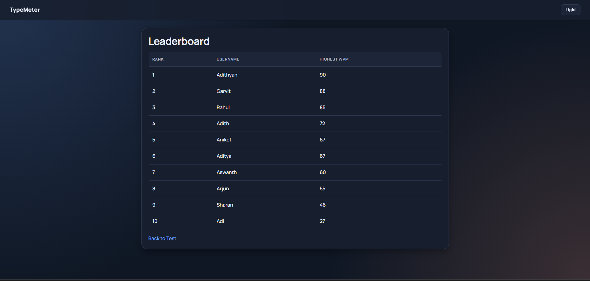
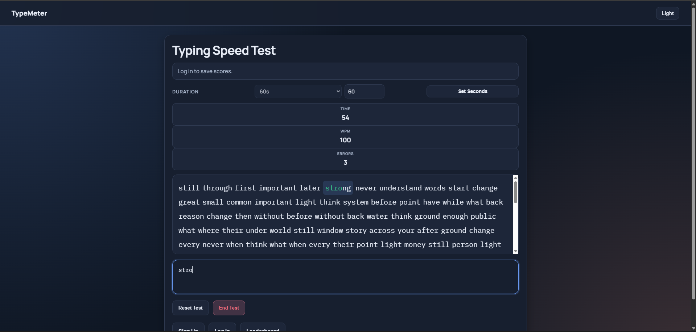
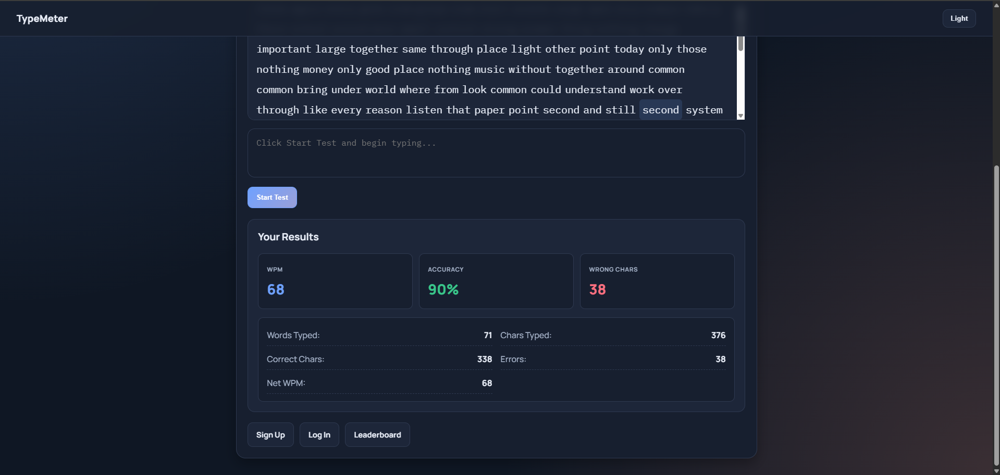
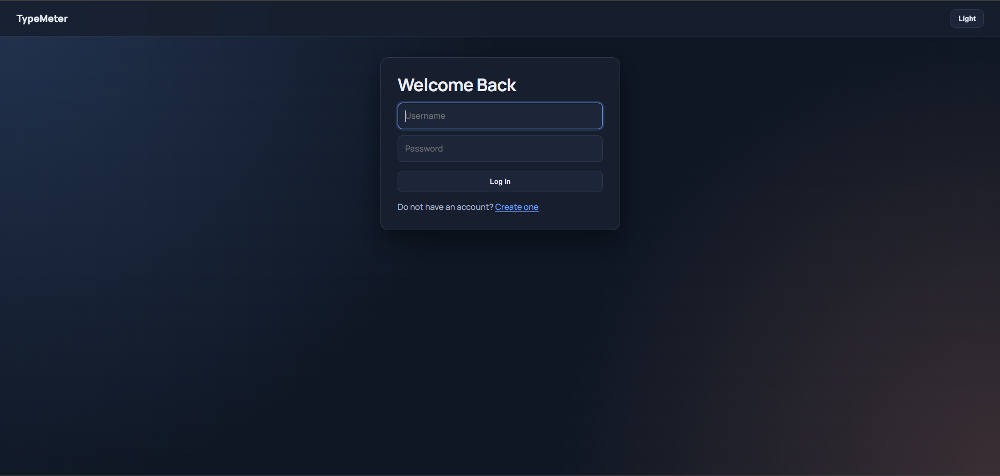

# TypeMeter ⌨️


> A full-stack typing speed test app with real-time metrics, user authentication, and competitive leaderboards.


---

## Screenshots

| Dark Mode | Light Mode | Leaderboard |
|-----------|------------|-------------|
|  |  |  |

| Typing Test | Results | Login |
|-------------|---------|-------|
|  |  |  |

---

## Features

- **Real-time typing engine** — live WPM, accuracy %, and error count as you type
- **Configurable test duration** — choose from presets or enter a custom time in seconds
- **Manual end** — stop the test early with the End Test button
- **User authentication** — secure signup, login, and session-based auth with bcrypt password hashing
- **Persistent score tracking** — best WPM saved per user across sessions
- **Leaderboard** — ranked by highest WPM, backed by MongoDB
- **Dark / Light theme** — preference persisted across visits
- **Responsive UI** — works on desktop and mobile

---

## Tech Stack

| Layer | Technology |
|-------|------------|
| Frontend | HTML, CSS, Vanilla JavaScript |
| Backend | Node.js, Express |
| Database | MongoDB, Mongoose |
| Auth | express-session, connect-mongo, bcryptjs |

---

## Project Structure

```
typing-test-app/
├── public/
│   ├── index.html          # Main typing test page
│   ├── leaderboard.html    # Leaderboard page
│   ├── login.html          # Login page
│   ├── signup.html         # Signup page
│   ├── style.css           # Global styles + theme
│   ├── script.js           # Typing engine & UI logic
│   └── theme.js            # Dark/light theme toggle
├── routes/
│   └── auth.js             # Auth & score API routes
├── models/
│   └── user.js             # Mongoose user schema
├── server.js               # Express app entry point
└── package.json
```

---

## Getting Started

### Prerequisites

- [Node.js](https://nodejs.org/) v16+
- A [MongoDB](https://www.mongodb.com/) instance (local or Atlas)

### Installation

1. **Clone the repository**

   ```bash
   git clone <your-repo-url>
   cd typing-test-app
   ```

2. **Install dependencies**

   ```bash
   npm install
   ```

3. **Configure environment variables**

   Create a `.env` file in the root directory:

   ```env
   PORT=3000
   MONGO_URI=your_mongodb_connection_string
   SESSION_SECRET=your_session_secret
   ```

4. **Start the server**

   ```bash
   npm start
   ```

5. **Open in your browser**

   ```
   http://localhost:3000
   ```

---

## API Reference

All routes are mounted under `/auth`.

| Method | Endpoint | Description | Auth Required |
|--------|----------|-------------|---------------|
| `POST` | `/auth/signup` | Register a new user | No |
| `POST` | `/auth/login` | Authenticate and start session | No |
| `GET` | `/auth/logout` | End session and clear cookie | Yes |
| `GET` | `/auth/me` | Get current user profile | Yes |
| `POST` | `/auth/save-score` | Save or update highest WPM | Yes |
| `GET` | `/auth/leaderboard` | Fetch top users ranked by WPM | No |

---

## How It Works

1. Start a test by clicking **Start** — a countdown begins and the prompt text appears.
2. Type the displayed text as fast and accurately as possible.
3. **WPM**, **accuracy**, and **errors** update in real time.
4. When the timer ends (or you click **End Test**), your results are displayed.
5. If logged in, your score is automatically saved if it's your personal best.
6. View the **Leaderboard** to see how you rank against other users.

---

## Security

- Passwords are hashed with **bcryptjs** before storage — plaintext passwords are never saved.
- Sessions are stored in MongoDB via **connect-mongo** and signed with a secret key.
- All score-saving routes require an active authenticated session.

> ⚠️ If any secrets or database credentials were committed to version history, rotate them immediately and generate fresh values before deploying.

---

## License

This project is open source. See [LICENSE](LICENSE) for details.
