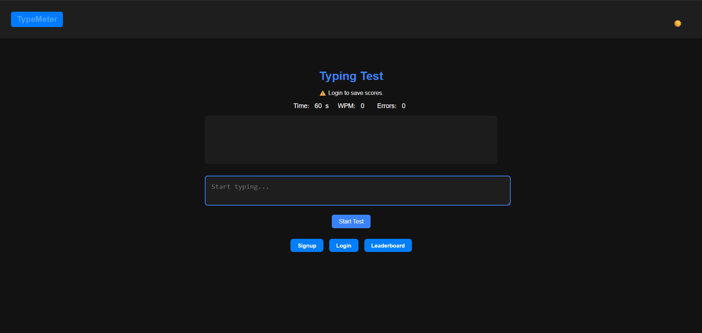
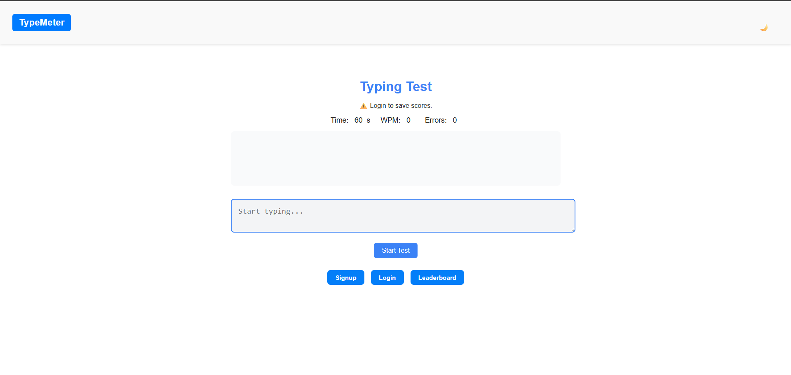
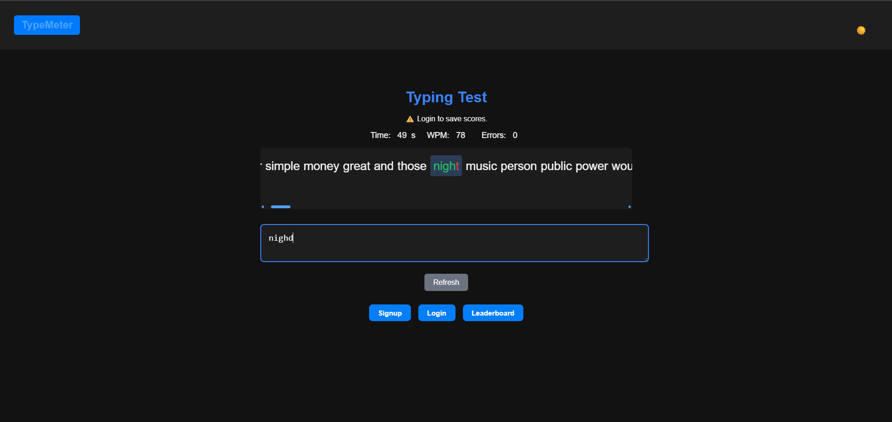
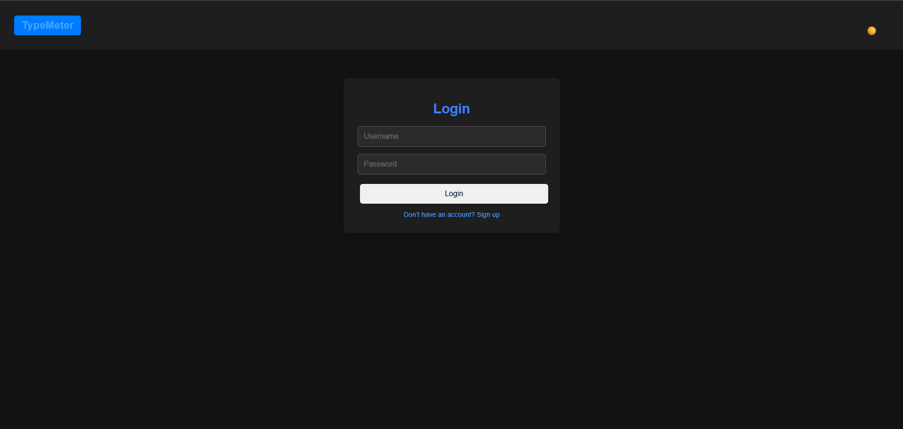
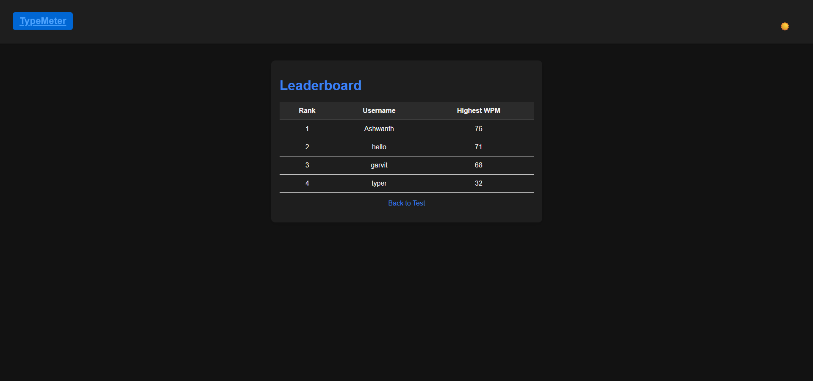

# Typing Test Web App ⌨️

A full-stack **Typing Speed Test Application** built with **Node.js, Express, MongoDB Atlas, HTML, CSS, and JavaScript**.  
Users can test their typing speed, view stats like WPM, accuracy, and errors, and compete on a global leaderboard.

---

## 🚀 Features
- Character-by-character typing validation (green for correct, red for incorrect).  
- Real-time **WPM (Words Per Minute)** calculation.  
- Tracks **Errors** and **Accuracy**.  
- **Leaderboard** with top performers (MongoDB).  
- User authentication (Signup/Login).  
- Dark mode toggle 🌙 / ☀️.  
- Responsive & clean UI.

---

## 📸 Screenshots

### Home Page - Dark Mode


### Home Page - Light Mode


### Typing Test in Progress


### Login Page


### Results Screen


### Leaderboard


---

## 🛠 Tech Stack
- **Frontend:** HTML, CSS, JavaScript  
- **Backend:** Node.js, Express  
- **Database:** MongoDB (Atlas / Local)  
- **Tools:** Git, Postman

---

## ⚙️ Installation & Setup

1. Clone the repo  
   ```bash
   git clone https://github.com/your-username/typing-test-app.git
   cd typing-test-app
   ```

2. Install dependencies  
   ```bash
   npm install
   ```

3. Start MongoDB locally or connect MongoDB Atlas.  

4. Run the server  
   ```bash
   node server.js
   ```

5. Visit in browser:  
   ```
   http://localhost:3000
   ```

---

## 📈 Future Improvements
- Add multiplayer typing races 🏁  
- More word lists & difficulty levels  
- Support for different test durations (30s, 1min, 2min)  

---

## 👨‍💻 Author
Developed by **Adithyan K**  


